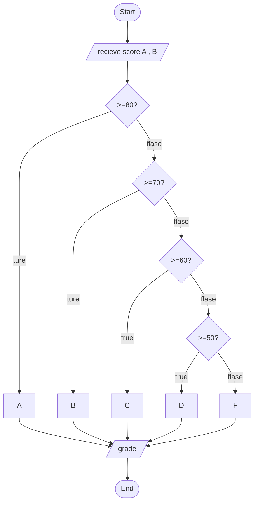
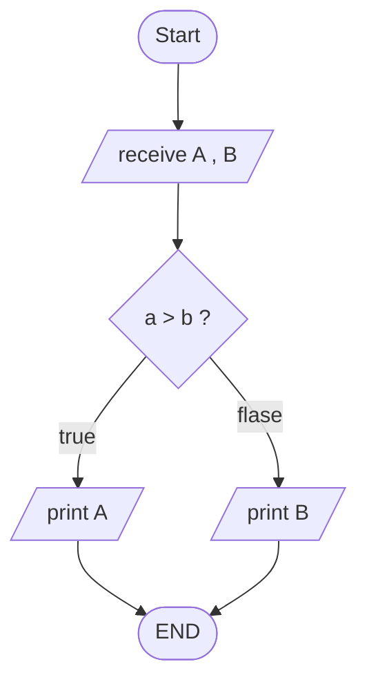
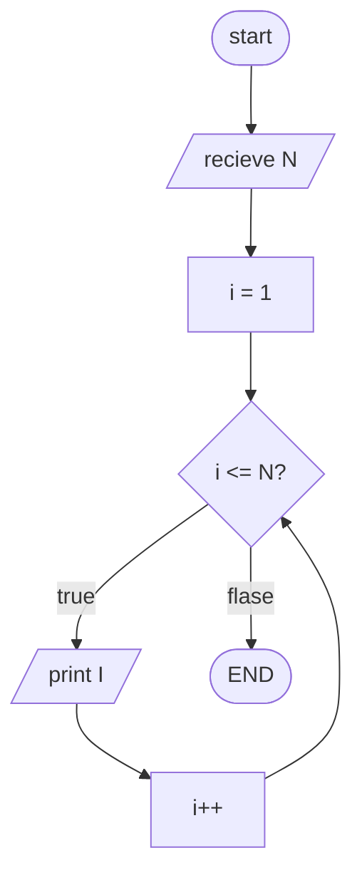

```mermaid
flowchart TD
S([Start]) --> I[/recieve score A , B /]
I --> D{>=80?}
D -->|ture| A[A]
D -->|flase| D2{>=70?}
D2 -->|ture| B[B]
D2 -->|flase| D3{>=60?}
D3 -->|true| C[C]
D3 -->|flase| D4{>=50?}
D4 -->|true| Dg[D]
D4 -->|flase| F[F]
A & B & C & Dg & F --> O[/grade/]
O --> E([End])
```

---

```mermaid
flowchart TD
	start([Start]) -->input[/receive A , B/]
	input --> P1{a > b ? }
	P1 --> |true| A[/ print A/]
	P1 --> |flase| B[/ print B/]
	A & B --> Output([END])


```

---

```mermaid
flowchart TD
	Start([start]) --> input[/recieve N/]
	input --> I[i = 1]
	I --> IR{i <= N?}
	IR --> |true| A[/ print I/]
	IR --> |flase| B([ END])
	A --> II[ i++]
	II --> IR


```

