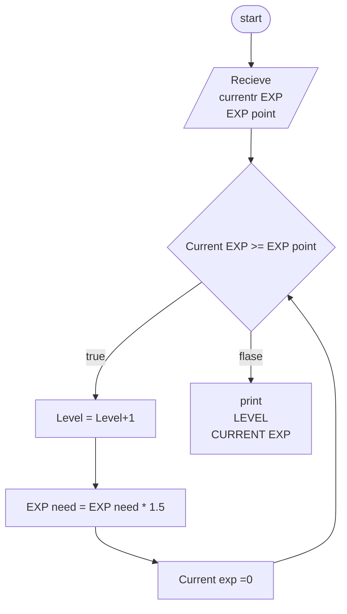

```mermaid
flowchart TD
	Start([start]) --> input[/Recieve 
currentr EXP
	EXP point/] --> UP{Current EXP >= EXP point}
	UP --> |true| LVUP[ Level = Level+1]
	LVUP --> CAPPLUS[EXP need = EXP need * 1.5]
	CAPPLUS --> RECAP[Current exp =0]
	RECAP -->
	UP --> |flase| SHOW[ print 
LEVEL
CURRENT EXP] 


```
