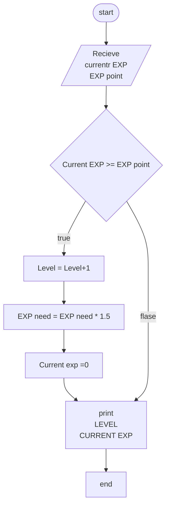
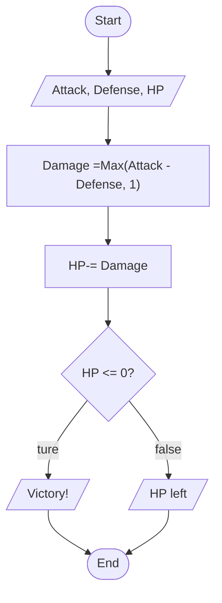
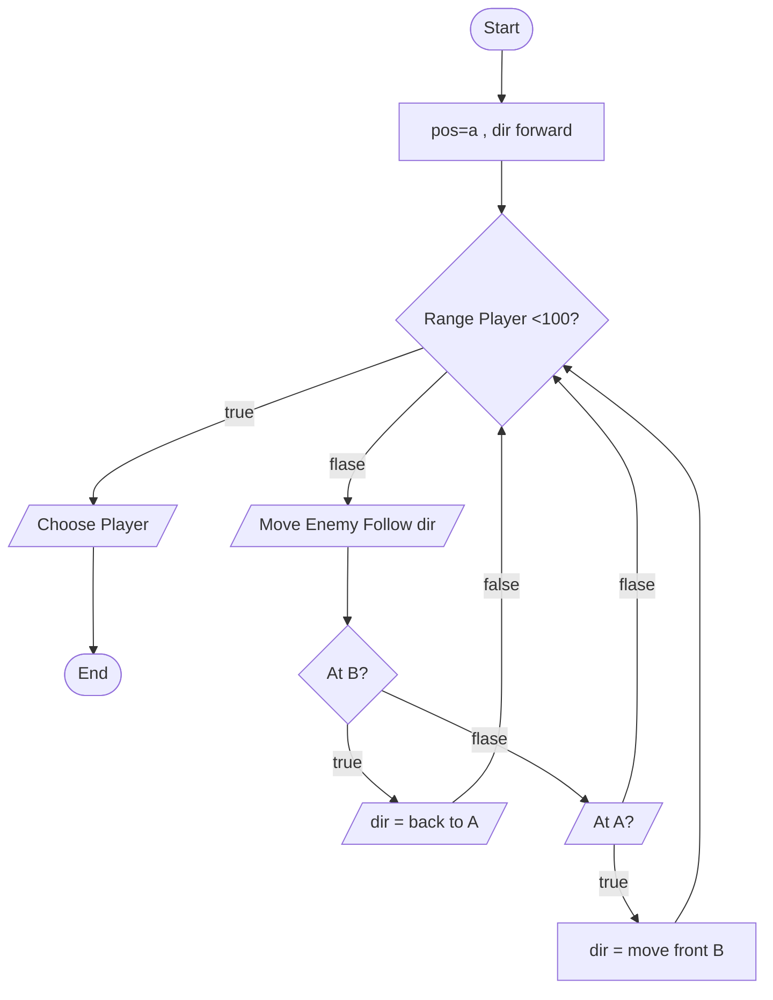

```mermaid
flowchart TD
	Start([start]) --> input[/Recieve 
currentr EXP
	EXP point/] --> UP{Current EXP >= EXP point}
	UP --> |true| LVUP[ Level = Level+1]
	LVUP --> CAPPLUS[EXP need = EXP need * 1.5]
	CAPPLUS --> RECAP[Current exp =0]
	RECAP --> SHOW
	UP --> |flase| SHOW[ print 
LEVEL
CURRENT EXP] --> END[end]


```

---

```mermaid
flowchart TD
	S([Start]) --> I[/Attack, Defense, HP/]
	I --> C["Damage =Max(Attack - Defense, 1)"]
	C --> R[HP-= Damage]
	R --> D{HP <= 0?}
	D -->|ture| W[/Victory!/]
	D -->|false| H[/HP left/]
	W & H --> E([End])
```

---

```mermaid
flowchart TD
	start([Start]) --> POS[pos=a , dir forward]
	POS --> RANGE{Range Player <100?}
	RANGE --> |true| A[/ Choose Player/]
	A --> END([End])
	RANGE --> |flase| B[/ Move Enemy Follow dir/]
	B --> F{At B?}
	F --> |true| BACK[/ dir = back to A/]
	BACK --> |false|RANGE
	F --> |flase| GO[/ At A?/]
	GO --> |true|MOVE[dir = move front B]
	GO --> |flase|RANGE
	MOVE --> RANGE

```
